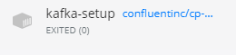
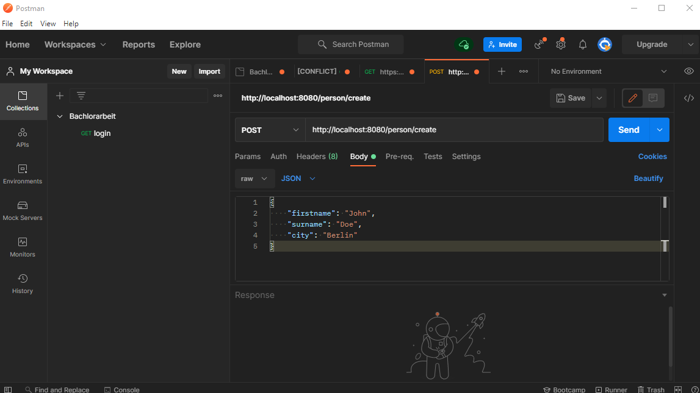

# Demo project #
This is a simple demo project to understand how Spring Boot, Kafka, Debezium and PostgreSQL works together.

## Service demo ##
The demo service provides a REST-Controller to create or delete a person.

## Service democonsumer ##
The democonsumer service contains a KafkaListener which listens to the topic person.
If the eventType is "person_created", the democonsumer logs a message.

## DebeziumTransformer ##
Debezium monitors the demo.outbox table, defined in the `initDb.sql`

## Run The System ##
- You need Docker Desktop
- Navigate in the commandline to the directory, in which the repository is
- Run Docker Desktop
- execute `docker-compose -f .\docker-compose.yml up --build -d`
- wait until the service `kafka-setup` has exited(0)
  
    
- start Postman and create a request like below
    
  
## Task for you ##
- Get in touch with RestController and KafkaListener. Create your own controller and methods to understand
how this techniques work.
- Get in touch with Postman

If you have questions, use the Webex backend channel. I will answer as fast as possible.